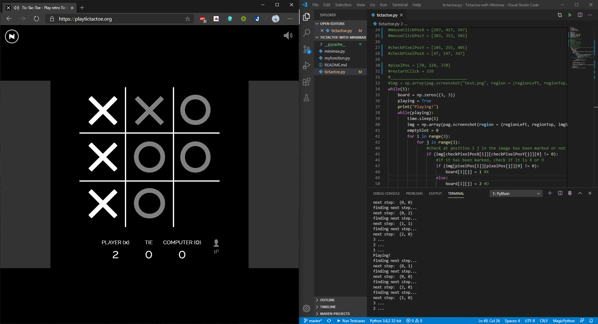
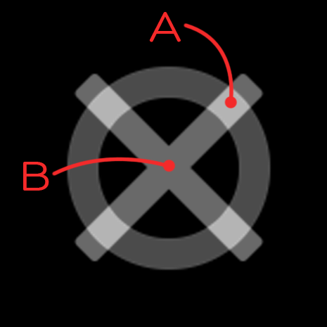
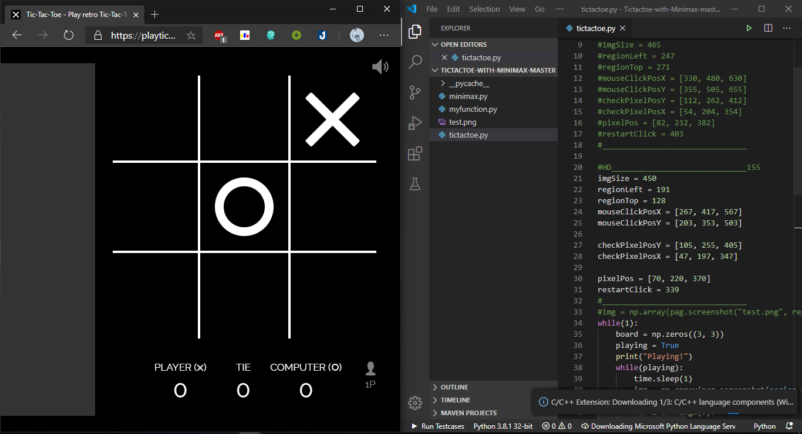

# Tictactoe-with-Minimax
Vietnamese:
### Giới thiệu
Chương trình dùng để demo chơi Tictactoe dùng thuật toán Minimax. Ở đây mình ứng dụng để đánh với bot của trang <https://playtictactoe.org>

### Demo

### Hướng dẫn chạy chương trình
Để lấy thông tin lúc đang chơi, mình chụp hình khu vực chơi và kiểm tra các điểm ảnh của hình để xác định ô đó đã được đánh, đánh X hay đánh O.

Để làm được điều đó, mình kiểm tra 2 pixel của mỗi ô, như hình dưới:

Nếu pixel ở vị trí A có màu trắng thì chắc chắn ô đó đã được đánh, tiếp theo mình sẽ kiểm tra pixel ở vị trí B, nếu pixel B này có màu trắng thì nó đã được đánh X, và ngược lại.

Kiểm tra xong 9 ô thì mình sẽ có một ma trận chứa thông tin của bàn cờ ở thời điểm hiện tại, việc tiếp theo là dùng thuật toán Minimax để quyết định nước đi tiếp theo thôi!

#### Lưu ý
Do mình kiểm tra các pixel bằng cách chụp màn hình rồi kiểm tra từng vị trí và kích thước ảnh chụp, vị trí các pixel kiểm tra là cố định nên chương trình chỉ chạy đúng trên màn hình có độ phân giải FullHD và đặt vị trí tab trò chơi ở bên trái giống như trên ảnh demo.
Mình có thêm phần thông số cho màn hình HD, và phải đặt vị trí như hình dưới đây:

